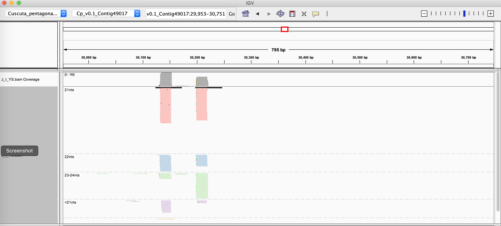
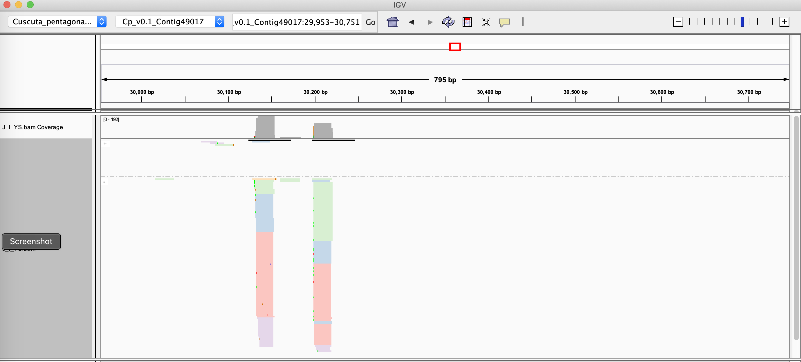
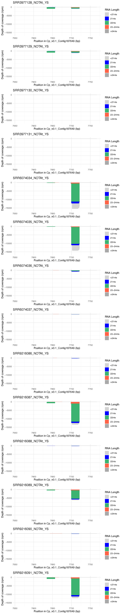

# sRNA_Viewer

## Synopsis

Tools for visualization of plant smallRNA-seq alignments, with an emphasis on distinguishing biologically relevant differences in small RNA size

## Author

Michael J. Axtell, The Pennsylvania State University, USA
mja18@psu.edu

## Installation

### Prerequisites
- Linux or Mac OS
- perl5 , installed at the usual /usr/bin/perl
- [R](https://www.r-project.org) , with packages "[tidyverse](https://www.tidyverse.org)", "[cowplot](https://cran.r-project.org/web/packages/cowplot/vignettes/introduction.html)", and "[docopt](https://github.com/docopt/docopt.R)"  installed. R version 4.0.0 was used for development. If needed, you can install the required packages (from within R) like so:
`install.packages(c("cowplot","tidyverse","docopt"))`
- [samtools](http://www.htslib.org) , installed in the user's PATH. samtools version 1.10 (using htslib 1.10) was used for development.

### Clone repo and install scripts

Clone the git repository

`git clone https://github.com/MikeAxtell/sRNA_Viewer.git`

Alternatively, if you don't have git installed, you can go to the [github page](https://github.com/MikeAxtell/sRNA_Viewer) and download a zip file containing the code.

cd into the sRNA_Viewer directory and ensure that the three scripts are executable. If not, use chmod to make them executable:
`chmod +x add_YS.pl`
`chmod +x sRNA_coverage.pl`
`chmod +x sRNA_Viewer.R`

For convenience, it is recommended that the three scripts (add_YS.pl, sRNA_coverage.pl, and sRNA_Viewer.R) be placed in the user's PATH so they can be called directly.

## Workflow

### Input data
- One or more positionally-sorted BAM formatted alignments of smallRNA-seq data. This can be made by [ShortStack](https://github.com/MikeAxtell/ShortStack), [bowtie](http://bowtie-bio.sourceforge.net/index.shtml), or whatever your aligner of choice is. When creating alignments, it's important to NOT condense your reads into unique sequence first ... the sRNA_Viewer processes assume that duplicate alignments reflect read abundance. 

### Adding YS tags

The first step is to process each BAM file to add a [custom tag](https://samtools.github.io/hts-specs/SAMtags.pdf), designated 'YS' to each alignment. The YS tag denotes the RNA size category of the aligned read. There are 5 values of YS tags defined, based on the biological distinctions of small RNA functions in plants (trigger warning: broad generalizations ahead!)

- "<21nts"  :: generally not thought to be Argonaute-loaded
- "21nts" :: generally associated with post-transcriptional silencing, WITHOUT secondary siRNA production
- "22nts" :: generally associated with post-transcriptional silencing, WITH secondary siRNA production
- "23-24nts" :: generally associated with transcriptional silencing / RNA-directed DNA methylation
- ">24nts" :: generally not thought to be Argonaute-associated

To add YS tags to a BAM file:
`add_YS.pl -b alignments.bam`

This will create a revised BAM file with the name `alignments_YS.bam` (in other words, '_YS' will be inserted in the name of the new file). You should then go ahead and index the new file:
`samtools index alignments_YS.bam`
The resulting .bai index file should remain in the same directory with it's cognate BAM file.

### Using IGV to view YS-tagged BAM files

[IGV](http://software.broadinstitute.org/software/igv/) can be used to visualize YS-tagged BAM files. The YS tags allow reads from different size classes to be separated or colored distinctly. Along with plotting by strand, this can be useful for data exploration. 

Below, we color the reads based on YS tag, and also group them by YS tag. To do this, use the right-click menu to control the BAM file appearance in IGV and select

- 'Group alignments by' --> 'tag' and enter YS
- 'Color aligments by' --> 'tag' and enter YS



IGV automatically colors and groups the reads based on the size categories. By changing 'Group alignments by' to 'Read strand', both the read lengths and the strandedness of the sRNAs can be viewed.



### Using sRNA_Viewer to view sRNA loci

Although useful, viewing using IGV has limitations. It's hard to fit more than two BAM files at once, you can't control the coloring of sRNA reads, and the aesthetics of the overall coverage is also hard to control. Moreover, snapshots of sRNA loci are not publication quality. The R script sRNA_Viewer.R and it's helper script sRNA_coverage.pl improve on this situation.

To use sRNA_Viewer, follow these steps

1. Process one or more BAM files with add_YS.pl to add YS tags. Index the files with samtools index.
2. Make a text file that is a simple list of YS-tagged BAM files, one file per line. If all of the BAM files are in your working directory, just the file names will suffice. Otherwise, provide the paths to the files. Example contents
```
/path/to/bamfiles/file1_YS.bam
/path/to/bamfiles/file2_YS.bam
/path/to/bamfiles/file3_YS.bam
```
3. Use a pipeline of sRNA_coverage.pl and sRNA_Viewer.R to create a pdf file of the locus of interest. The locus of interest is specified in the format Chromosome:Start-Stop , where Start and Stop are integers representing positions along the chromosome. Example

`sRNA_coverage.pl -b bamfileList.txt -c Chr1:10993-11087 | sRNA_Viewer.R -p output.pdf`

The above command would create a pdf file called 'output.pdf' that showed sRNA depth of coverage from a chromosome called "Chr1" from position 10993 to 11087. The sRNA_coverage.pl script creates a tab-delimited text output to STDOUT. That can be piped into sRNA_Viewer.R to create the image in one step.

Alternatively, the process can be broken into two separate steps, first writing a tab-delimited text file of depths using sRNA_coverage.pl , then inputting that to sRNA_Viewer.R using option -c

`sRNA_coverage.pl -b bamfileList.txt -c Chr1:10993-11087 > coverage.tsv`

`sRNA_Viewer.R -c coverage.tsv -p output.pdf`



The image above is an example outout from sRNA_Viewer.R. It is a microRNA locus that mostly makes 22 nt miRNAs. The negative numbers indicate accumulation from the - genomic strand. There is obvious differential expression when comparing the 12 different libraries. The two "stacks" of reads represent the microRNA and microRNA* strands, typical of microRNA biogenesis.


