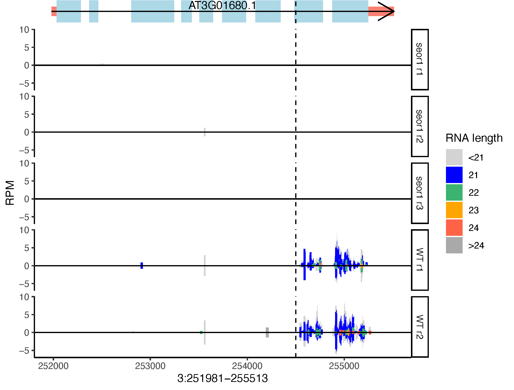

# sRNA_Viewer

## Synopsis

Visualization of plant smallRNA-seq alignments, with an emphasis on distinguishing biologically relevant differences in small RNA size

## Author

Michael J. Axtell, The Pennsylvania State University, USA
mja18@psu.edu

## Example image


## Motivation
Genome browsers are ill-suited to render alignments of small RNA-seq data. To interpret this type of data, users to need to be able to visualize three parameters:

1. Depth of coverage
2. Strandedness of coverage
3. Small RNA sizes

Most (all?) genome browsers cannot simultaneously visualize all three of these track parameters. Furthermore, users often want to compare multiple tracks visually. This requires a set normalization (such as reads per million) be applied to each alignment track *AND* the y-axis scaling set in a uniform fashion across all tracks. Genome browsers generally can't do this.

So, this script is a way to visualize small RNA-seq alignments that does meet all of these parameters.

## Installation

### Install dependencies. You will need: 

- Linux or Mac OS
- [R](https://www.r-project.org) , with packages "[tidyverse](https://www.tidyverse.org)", "[cowplot](https://cran.r-project.org/web/packages/cowplot/vignettes/introduction.html)", 
"[IRanges](https://bioconductor.org/packages/release/bioc/html/IRanges.html)" and "[docopt](https://github.com/docopt/docopt.R)"  installed.
- [samtools](http://www.htslib.org) , installed in the user's PATH. Requires samtools version >= 1.10 !

2. Download script and `chmod +x sRNA_Viewer` to make the script executable. If desired move to a location in your `PATH`.


## Usage
```
  sRNA_Viewer [-g TABIXGFF -l VLINE -r RGLIST] -c COORDINATES -b BAMLIST -p OUTPUTFILE
  sRNA_Viewer -h | --help
  sRNA_Viewer -v | --version
```

## Required inputs

- `-c COORDINATES` : Location to analyze in format Chr:Start-Stop (one-based, inclusive)
- `-b BAMLIST` : A .csv file listing the bamfiles, along with the user's preferred display names. The display names are what each track will be labeled with on the figure (unless read-groups are used, see below). Each bam file must be readable, positionally sorted, and already indexed (using `samtools index`).
- `-p OUTPUTFILE` : Output .pdf file to be created.

## Optional inputs
- `-g TABIXGFF` : tabix-ed gff3 file containing transcript/mRNA, exon, and CDS. See section below for preparation instructions. Providing this file will allow rendering of transcript models.
- `-l VLINE` : x-coordinate to draw a vertical line at. A single integer, within the coordinates provided by option `-c`.
- `-r RGLIST` : This is a csv file with read groups in column 1, display names in column 2. Applies to first bamfile from BAMLIST. Providing this information will cause the specified read groups (specified by @RG tags) to be plotted in separate tracks. This will applied to the first bam file in the `-b BAMLIST` file only. 

## Preparing a tabix-indexed GFF3
sRNA_Viewer can use a bgzip-compressed, tabix-indexed GFF3 file of transcripts. Only the annotation types of `transcript`, `mRNA`, `exon`, and `CDS` are recognized and used. 

Here is an example of how to process a gff3 file for use by sRNA_Viewer

```
grep -e '\smRNA\s' -e '\stranscript\s' -e '\sexon\s' -e '\sCDS\s' mygff.gff | sort -k1,1 -k4,4n | bgzip > mygff_sorted.gff.gz

tabix -p gff mygff_sorted.gff.gz
```

This will create two new files: `mygff_sorted.gff.gz` and its index `mygff_sorted.gff.gz.tbi`. In option `-g` specify the file `mygff_sorted.gff.gz`. (The corresponding index must be in the same location).

## Performance

Using only `-b` to specify multiple individual bam files is faster than using `-b` and `-r` to specify multiple read-groups from a single merged bam file. 


